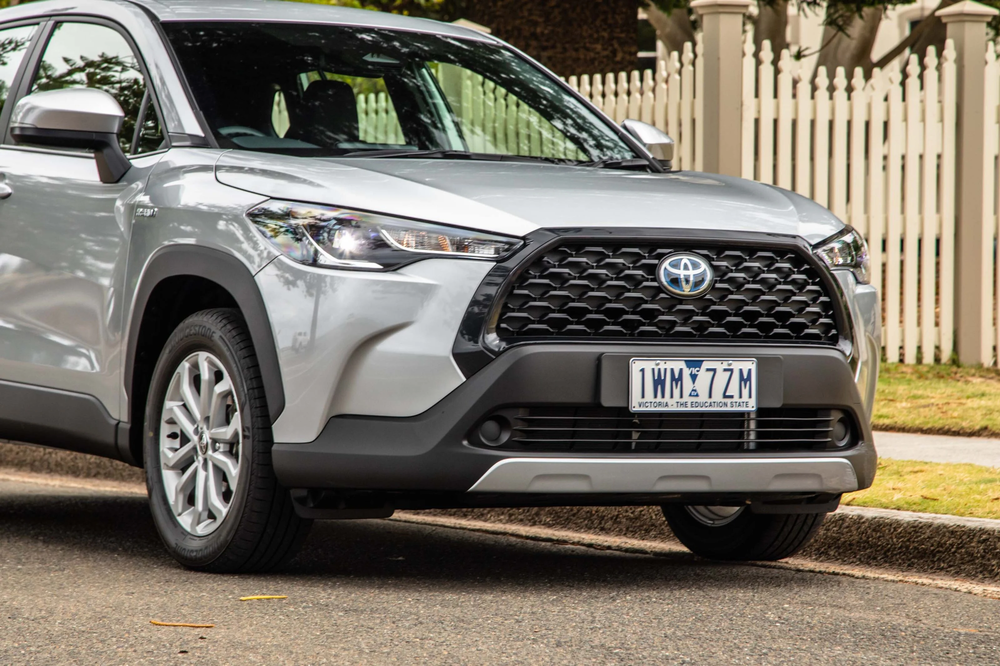
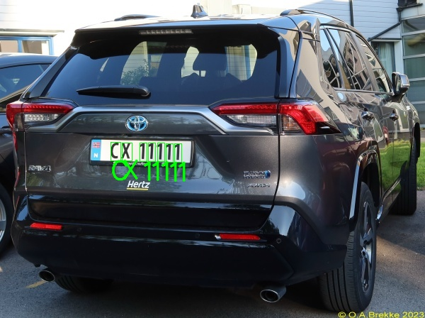

# Lightweight License Plate Character Recognition

This project implements a character recognition pipeline for license plates using PyTorch and OpenCV. It supports:

---

## Features
- End-to-end character recognition pipeline
- CNN-based classifier using TinyCNN architecture
- Noise-resilient image preprocessing & augmentation
- Batch prediction and automatic annotation
- Tailored for **Australian license plates**

---

## Example
**Input Image 1:**

**Predicted Output 1:**

**Input Image 2:**

**Predicted Output 2:**

---

## Model Training

The model is trained on a subset of the **[Chars74K dataset](https://info-ee.surrey.ac.uk/CVSSP/demos/chars74k/)** (`EnglishFnt.tgz`).  
Only characters **visually similar** to Victorian license plates were manually retained to ensure performance on real-world data.

# Dataset Preparation

Download **[EnglishFnt.tgz](https://info-ee.surrey.ac.uk/CVSSP/demos/chars74k/EnglishFnt.tgz)**

Extract to ./dataset/train/

Manually remove non-standard / stylized characters not visually aligned with Victorian plates

## Project Structure
'''
.
├── train.py              # Training script
├── main.py               # Main entry for prediction & visualization
├── preprocess.py         # Contour detection and filtering logic
├── chopped.py            # Postprocessing (resizing, border fixing, etc.)
├── dataset/              # Directory for /train and /test directories
├── input/                # Directory for input images to be recognized
├── output/               # Inference results with annotated predictions
└── char_cnn.pth          # Trained model weights
'''

## Project Structure
python main.py
Ensure test images are in ./test_img. Annotated results will be saved to ./output.

## Acknowledgement

- Chars74K Dataset
- OpenCV & PyTorch
